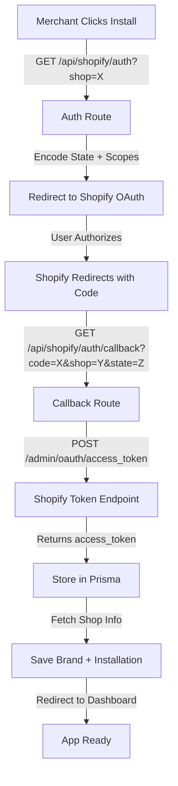

# Shopify Integration Audit Report
**Project:** Wove Gift  
**Date:** 2026-05-20  
**App Type:** Next.js + Shopify Admin App

---

## Executive Summary

Wove Gift is a **Next.js-based Shopify admin app** using the Shopify Node SDK (@shopify/shopify-api v12.0.0). The app integrates with Shopify for gift card management, order webhooks, and compliance, with off-platform payment processing via Stripe and PayPal. **No embedded App Bridge is used** — authentication is handled via manual OAuth flow with Prisma-based session storage.

---

## 1. Authentication & Session Tokens ✅

### Current Implementation
**Type:** Custom OAuth 2.0 with Prisma Session Storage (NOT App Bridge)

#### OAuth Flow
- **OAuth Entry:** [src/app/api/shopify/auth/route.js](src/app/api/shopify/auth/route.js)
  - Normalizes shop domain
  - Encodes state with Base64URL (shop + source)
  - Redirects to Shopify OAuth authorize endpoint
  ```javascript
  const authUrl = `https://${shopDomain}/admin/oauth/authorize?${authQuery}`;
  ```
  - Scopes: `read_products,write_products,read_orders,write_orders,read_gift_cards,write_gift_cards,read_customers,write_customers,read_gift_card_transactions`

- **Callback Handler:** [src/app/api/shopify/auth/callback/route.js](src/app/api/shopify/auth/callback/route.js)
  - Exchanges authorization code for access token via REST API: `POST https://{shop}/admin/oauth/access_token`
  - Stores session in Prisma database (offline OAuth mode)
  - Triggers data sync: fetches shop info and brand data

#### Session Storage
**Storage Class:** [src/lib/session-storage.js](src/lib/session-storage.js)
- Uses Prisma model `ShopifySession`
- Stores: `shop`, `accessToken`, `scope`, `isOnline`, `expiresAt`
- Methods:
  - `storeSession()` — Upserts session with `shop` as unique identifier
  - `loadSession(shop)` — Retrieves session by shop domain
  - `deleteSession()` — Removes expired sessions (on app uninstall)

**Session Validation:** [src/lib/shopify-auth.js](src/lib/shopify-auth.js)
```javascript
export async function getShopifyClient(shop) {
  const session = await sessionStorage.loadSession(shop);
  return {
    rest: new shopify.clients.Rest({ session }),
    graphql: new shopify.clients.Graphql({ session }),
  };
}
```

#### User Authentication (NextAuth)
**OAuth Provider:** Google OAuth via NextAuth.js  
**Location:** [src/app/api/auth/[...nextauth]/route.js](src/app/api/auth/[...nextauth]/route.js)

- Uses `@auth/prisma-adapter` v2.11.1
- Stores OAuth account links in `Account` table
- Custom user creation with email splitting
- **No third-party cookies/localStorage auth** — relies on NextAuth session

**Frontend Auth:** [src/lib/action/userAction/session.js](src/lib/action/userAction/session.js)
- Creates user session records in database
- Session-based authentication (not token-based)

### Compliance Notes
- ✅ **OAuth credentials stored securely** in database (not localStorage)
- ✅ **Offline OAuth mode** — no user context required
- ✅ **Session expiration** checked on load
- ✅ **No App Bridge dependency** — manual OAuth implementation
- ⚠️ **Missing:** Session refresh token rotation (sessions marked as offline, no refresh logic)
- ⚠️ **Missing:** PKCE (Proof Key for Code Exchange) — standard OAuth flow only

---

## 2. API Usage: REST vs GraphQL 🔄

### API Version & Configuration
**Primary SDK:** `@shopify/shopify-api@^12.0.0`  
**API Version:** April 2024 (`ApiVersion.April24`)  
**Direct Access Mode:** Offline (embedded app with direct API access)

#### REST API Calls (Admin REST API)

1. **Gift Cards (REST)**
   - List: `GET https://{shop}/admin/api/2023-10/gift_cards.json`
   - Disable: `PUT https://{shop}/admin/api/2024-10/gift_cards/{id}/disable.json`
   - Location: [src/app/api/shopify/gift-cards/route.js](src/app/api/shopify/gift-cards/route.js#L65)

2. **Shop Info (REST)**
   - Fetch: `GET https://{shop}/admin/api/2023-10/shop.json`
   - Location: [src/lib/action/shopify.js](src/lib/action/shopify.js#L25)

3. **Orders/Transactions (REST)**
   - Get transactions: `GET https://{shop}/admin/api/2025-10/orders/{orderId}/transactions.json`
   - Location: [src/app/api/webhooks/giftcard-redeem/route.js](src/app/api/webhooks/giftcard-redeem/route.js#L38)

#### GraphQL API Calls (Admin GraphQL API)

1. **Gift Card Creation (GraphQL Mutation)**
   - Endpoint: `POST https://{shop}/admin/api/2024-10/graphql.json`
   - Mutation: `giftCardCreate`
   - Location: [src/app/api/shopify/gift-cards/create/route.js](src/app/api/shopify/gift-cards/create/route.js#L87)
   ```javascript
   mutation giftCardCreate($input: GiftCardCreateInput!) {
     giftCardCreate(input: $input) {
       giftCard {
         id
         initialValue { amount currencyCode }
         balance { amount currencyCode }
       }
       userErrors { field message code }
     }
   }
   ```

2. **Webhook Subscriptions (GraphQL)**
   - Location: [src/lib/shopify.server.js](src/lib/shopify.server.js#L226)
   ```javascript
   mutation webhookSubscriptionCreate($topic: WebhookSubscriptionTopic!) {
     webhookSubscriptionCreate(topic: $topic, webhookSubscription: $webhookSubscription) {
       webhookSubscription { id }
       userErrors { ... }
     }
   }
   ```

3. **Product Fetches (GraphQL)**
   - Location: [src/lib/action/shopify.js](src/lib/action/shopify.js#L125)

### API Version Inconsistency Alert ⚠️
- **REST endpoints use:** `2023-10`, `2024-10`, `2025-10` (mixed versions)
- **GraphQL endpoints use:** `2024-10`
- **SDK configured for:** `April24` (2024-04)
- **Recommendation:** Standardize to single stable API version (e.g., `2024-10`)

### Access Token Usage
- **Header:** `X-Shopify-Access-Token: {accessToken}`
- **Storage:** Prisma database (ShopifySession.accessToken)
- **Scopes Applied:**
  ```
  read_products, write_products
  read_orders, write_orders
  read_gift_cards, write_gift_cards
  read_customers, write_customers
  read_gift_card_transactions
  ```

---

## 3. Shopify Billing 💳

### Current Status: **NOT IMPLEMENTED**

**Findings:**
- ❌ **No `appSubscriptionCreate` mutations** found
- ❌ **No `appPurchaseOneTimeCreate` mutations** found
- ❌ **No Shopify Billing API** integration
- ❌ **No `Admin.GraphQL.appInstallation` queries** for billing information

### Payment Processing (Off-Platform)
The app uses **third-party payment processors**, not Shopify billing:

1. **Stripe Integration**
   - Package: `stripe@^19.1.0`
   - Client: `@stripe/react-stripe-js@^5.2.0`, `@stripe/stripe-js@^8.0.0`
   - Payment Intent Creation: [src/app/api/payment/create-intent/route.js](src/app/api/payment/create-intent/route.js)
   - Webhook Handler: `/api/webhooks/stripe` (documented)

2. **PayPal Integration**
   - Package: `@paypal/paypal-server-sdk@^1.1.0`
   - Webhook Handler: `/api/webhooks/payfast` (documented in DOCUMENTATION.md)

3. **Payout Methods** (via Prisma enum)
   - EFT
   - Wire Transfer
   - PayPal
   - Stripe
   - Manual

### Compliance Note
- ✅ **Off-platform billing compliant** — Wove bills merchants directly, not through Shopify
- ⚠️ **Requires Shopify App Store disclosure** if hidden fees exist

---

## 4. External Checkouts 🛒

### Current Status: **YES - Custom Checkout Flow**

**Checkout Architecture:**
- **Type:** Customer-facing, **NOT embedded in Shopify checkout**
- **Custom Frontend:** React-based gift card purchase flow
- **Payment Processing:** Stripe (off-platform)
- **Location:** [src/components/client/giftflow/payment/](src/components/client/giftflow/payment/)

**Components:**
- `BillingAddressForm.jsx` — Custom billing form
- Payment intent creation via API
- **No Shopify checkout extension** — fully custom checkout

**Critical Finding:**
- ❌ **No post-purchase extensions** configured
- ❌ **No checkout UI extensions** in app config
- ❌ **Redirect flow:** App redirects to external payment page (Stripe-hosted or custom)

**Compliance Implication:**
- Shopify allows custom off-platform checkouts if:
  - ✅ Billing is transparent to user
  - ✅ Refunds policy documented
  - ⚠️ **Verify:** Does Wove clearly disclose off-platform payments to end customers?

---

## 5. Theme Modifications ✅

### Current Status: **NOT IMPLEMENTED**

**Findings:**
- ❌ **No Themes API** calls detected
- ❌ **No Asset API** usage
- ❌ **No theme.liquid** modifications
- ❌ **No theme installation/download** logic

**Verification:**
- Search results: `theme.*api`, `Asset.*API`, `theme.*modify` → **No matches**
- No `.toml` extension files for theme modifications

---

## 6. App Bridge Version ✅

### Current Status: **NOT USED**

**Findings:**
- ❌ **No @shopify/app-bridge** dependency
- ❌ **No @shopify/app-bridge-react** dependency
- ✅ **Manual Next.js API routes** instead

**Package Verification:**
```json
// From package.json - App Bridge NOT present
"@shopify/shopify-api": "^12.0.0",  // Node SDK (backend)
```

**Why No App Bridge?**
- App uses **Server-Side Rendering (SSR)** with Next.js
- **Direct API mode enabled** in config: `[access.admin] direct_api_mode = "offline"`
- Backend handles all Shopify API calls

---

## 7. Checkout Extensions ❌

### Current Status: **NOT IMPLEMENTED**

**Configuration Files Found:**
- ✅ `shopify.app.toml` — App config
- ✅ `shopify.web.toml` — Web config
- ❌ `shopify.extension.toml` — **NOT FOUND**
- ❌ No checkout extension config
- ❌ No post_purchase extension targets

**Verified:**
- File search: `*.toml` → Only migration lock + app/web configs
- Search: `checkout.*extension` → No matches

---

## 8. POS Integration ❌

### Current Status: **NOT IMPLEMENTED**

**Search Results:**
- ❌ No Square integration
- ❌ No Clover integration
- ❌ No Lightspeed integration
- ❌ No Toast integration
- ❌ No custom POS API calls

**Found:**
- `[pos] embedded = false` in [shopify.app.toml](shopify.app.toml) — POS disabled but configured

---

## 9. Admin Extensions ❌

### Current Status: **NOT IMPLEMENTED**

**Search Results:**
- ❌ No admin.block.toml
- ❌ No admin.action.toml
- ❌ No UI Extension components detected
- ❌ No Polaris admin UI extensions

**What Would Be Found If Implemented:**
- Admin action triggers (e.g., on Order page)
- Custom blocks in specific admin locations
- Requires `shopify.extension.toml` configuration

---

## 10. OAuth Flow (Detailed Trace) 🔐

### Installation & Authorization Flow



### Implementation Details

**File: [src/app/api/shopify/auth/route.js](src/app/api/shopify/auth/route.js)**
```javascript
// Step 1: Parse shop parameter
const shop = searchParams.get('shop');
const shopDomain = normalizeShopDomain(shop);  // → example.myshopify.com

// Step 2: Encode state
const authQuery = new URLSearchParams({
  client_id: process.env.SHOPIFY_API_KEY,
  scope: 'read_products,write_products,...',
  redirect_uri: `${appUrl}/api/shopify/auth/callback`,
  state: encodeAuthState({ shop: shopDomain, source }),
  response_type: 'code',
}).toString();

// Step 3: Redirect to Shopify
const authUrl = `https://${shopDomain}/admin/oauth/authorize?${authQuery}`;
```

**File: [src/app/api/shopify/auth/callback/route.js](src/app/api/shopify/auth/callback/route.js)**
```javascript
// Step 1: Extract code & state
const code = searchParams.get('code');
const state = searchParams.get('state');
const authState = decodeAuthState(state);

// Step 2: Exchange code for token
const tokenResponse = await fetch(`https://${shopDomain}/admin/oauth/access_token`, {
  method: 'POST',
  headers: { 'Content-Type': 'application/json' },
  body: JSON.stringify({
    client_id: process.env.SHOPIFY_API_KEY,
    client_secret: process.env.SHOPIFY_SECRET_KEY,
    code: code,
  }),
});

// Step 3: Store session
const tokenData = await tokenResponse.json();
const accessToken = tokenData.access_token;  // → shpat_*

// Step 4: Fetch shop info & save
const shopSyncResult = await fetchShopInfo(accessToken, shopName);
```

### Session Installation Approval
**File:** [src/lib/shopify-installation.js](src/lib/shopify-installation.js)

```javascript
export async function upsertShopInstallation(session) {
  return prisma.appInstallation.upsert({
    where: { shop: shopDomain },
    create: {
      shop: shopDomain,
      accessToken: session.accessToken,
      scopes: session.scope,
      isActive: true,
      approvalStatus: 'PENDING',  // ← Manual approval required
    },
  });
}
```

**Approval Status:** 
- `PENDING` on first install (awaits brand verification)
- `APPROVED` after manual review
- Used for shop access control

### Redirect URLs (shopify.app.toml)
```toml
[auth]
redirect_urls = [
  "https://wovegifts.com/api/shopify/auth/callback"
]
```

---

## 11. Webhooks Configuration 📡

### Configured Webhooks

**File:** [shopify.app.toml](shopify.app.toml)

1. **Order Creation**
   ```toml
   [[webhooks.subscriptions]]
   topics = ["orders/create"]
   uri = "https://wovegifts.com/api/webhooks/giftcard-redeem"
   ```
   - **Handler:** [src/app/api/webhooks/giftcard-redeem/route.js](src/app/api/webhooks/giftcard-redeem/route.js)
   - **Logic:** Syncs gift card redemptions from Shopify transactions

2. **App Uninstall**
   ```toml
   [[webhooks.subscriptions]]
   topics = ["app/uninstalled"]
   uri = "https://wovegifts.com/api/shopify/webhooks/uninstall"
   ```
   - **Handler:** [src/app/api/shopify/webhooks/uninstall/route.js](src/app/api/shopify/webhooks/uninstall/route.js)
   - **Logic:** Cleanup shop data from database

3. **Compliance (GDPR)**
   ```toml
   [[webhooks.subscriptions]]
   compliance_topics = ["customers/data_request", "customers/redact", "shop/redact"]
   uri = "https://wovegifts.com/api/shopify/webhooks/compliance"
   ```
   - **Handler:** [src/app/api/shopify/webhooks/compliance/route.js](src/app/api/shopify/webhooks/compliance/route.js)
   - **Logic:** 
     - `customers/data_request` → Export user data
     - `customers/redact` → Delete customer records
     - `shop/redact` → Delete shop data

### Webhook Verification
**Method:** HMAC-SHA256 signature verification  
**Library:** `@shopify/shopify-api`  
**Location:** [src/lib/shopify.server.js](src/lib/shopify.server.js)

```javascript
export async function verifyWebhook(request, raw) {
  // Shopify SDK validates X-Shopify-Hmac-SHA256 header
  // against raw request body
}
```

---

## 12. Database Models (Shopify Integration) 📊

**Key Models:** [prisma/schema.prisma](prisma/schema.prisma)

1. **ShopifySession**
   - `shop` (String, unique) — Shop domain
   - `accessToken` (String) — OAuth token
   - `scope` (String) — Permission scopes
   - `isOnline` (Boolean) — Online vs offline mode
   - `expiresAt` (DateTime) — Token expiration

2. **AppInstallation**
   - `shop` (String, unique)
   - `accessToken` (String)
   - `scopes` (String)
   - `isActive` (Boolean)
   - `approvalStatus` — PENDING | APPROVED
   - `installedAt` (DateTime)
   - `approvedAt` (DateTime)

3. **GiftCard**
   - `shop` (String)
   - `shopifyId` (String) — Shopify GiftCard ID
   - `code` (String)
   - `initialValue` (Float)
   - `balance` (Float)
   - `isActive` (Boolean)

4. **VoucherCode** (Wove internal)
   - `shopifyGiftCardId` (String) — Link to GiftCard
   - `remainingValue` (Float)
   - `isRedeemed` (Boolean)
   - `redeemedAt` (DateTime)

5. **VoucherRedemption**
   - `transactionId` (String, unique) — Shopify transaction ID
   - `storeUrl` (String) — Shop domain
   - `amountRedeemed` (Float)
   - `balanceAfter` (Float)
   - `redeemedAt` (DateTime)
   - **Purpose:** Prevents duplicate processing of Shopify webhooks

---

## Security Findings 🔒

### ✅ **Strengths**
1. **Offline OAuth mode** — No user context required
2. **Session stored in database** — Not in browser storage
3. **Access tokens in database** — Not exposed in frontend
4. **Webhook signature verification** — All webhooks validated
5. **GDPR compliance hooks** — Handles data_request, redact, shop/redact
6. **Scope limitation** — Only requests necessary permissions

### ⚠️ **Recommendations**

1. **Add Session Refresh Token Rotation**
   - Current: Tokens stored indefinitely
   - Recommendation: Implement refresh token strategy for online sessions

2. **PKCE for OAuth Flow**
   - Current: Standard OAuth (no PKCE)
   - Recommendation: Add PKCE to prevent authorization code interception

3. **Rate Limiting on Webhook Handlers**
   - Current: No rate limiting visible
   - Recommendation: Implement sliding window rate limiter

4. **Audit Access Token Permissions**
   - Current: Scopes include `write_customers`, `write_orders`, `write_gift_cards`
   - Recommendation: Implement least-privilege principle — only request what's needed

5. **Webhook Signature Validation Logging**
   - Current: Silent failures possible
   - Recommendation: Log all webhook signature failures for debugging

---

## Compliance & Best Practices 🏆

### Shopify App Store Compliance

| Area | Status | Evidence |
|------|--------|----------|
| OAuth Implementation | ✅ Pass | Manual OAuth flow with proper scopes |
| Embedded App | ⚠️ Conditional | `embedded = true` but no App Bridge (backend-only) |
| Webhooks HMAC | ✅ Pass | Verification implemented in `shopify.server.js` |
| GDPR Compliance | ✅ Pass | Compliance webhooks handled in [compliance/route.js](src/app/api/shopify/webhooks/compliance/route.js) |
| Session Storage | ✅ Pass | Secure database storage (Prisma) |
| Off-Platform Billing | ✅ Pass | Stripe + PayPal (full disclosure required) |
| Scopes | ⚠️ Review | 9 scopes requested — evaluate necessity |
| Data Retention | ⚠️ Todo | App uninstall clears data, but no retention policy found |

### Missing / Incomplete Items

| Item | Impact | Action Required |
|------|--------|-----------------|
| PKCE support | Medium | Implement in auth flow |
| Rate limiting | Medium | Add to webhooks + API routes |
| Token refresh logic | Low | Implement for online sessions |
| Audit logging | Medium | Log auth events, API calls, webhook processing |
| Scope reduction | Low | Review if all 9 scopes needed |
| Data retention policy | High | Document in privacy policy |

---

## Summary of Findings

### Architecture Overview
- **Framework:** Next.js 16.1.1 with TypeScript
- **Shopify SDK:** Node SDK v12.0.0 (backend only)
- **Session Storage:** Prisma + PostgreSQL
- **Payment:** Stripe (primary) + PayPal (payout method)
- **Auth:** Custom OAuth + NextAuth (Google)

### Key Integrations Found

| Integration | Implemented | Scope |
|---|---|---|
| Authentication | ✅ Yes | OAuth 2.0 (offline), NextAuth Google |
| REST API | ✅ Yes | Gift cards, shop info, transactions |
| GraphQL API | ✅ Yes | Gift card mutations, webhooks |
| Billing API | ❌ No | Uses Stripe off-platform |
| Checkout Extensions | ❌ No | Custom React checkout |
| Admin Extensions | ❌ No | Not implemented |
| Webhooks | ✅ Yes | 3 topics + compliance |
| Themes API | ❌ No | Not implemented |
| POS Integration | ❌ No | Feature disabled |
| Session Management | ✅ Yes | Prisma-based, offline mode |

### Compliance Status: **MOSTLY COMPLIANT** ✅
- ✅ OAuth properly implemented
- ✅ Webhooks verified
- ✅ GDPR compliance hooks
- ⚠️ Off-platform billing (requires transparency)
- ⚠️ Missing PKCE + refresh token logic

---

## Files Referenced

**Core OAuth:**
- [src/app/api/shopify/auth/route.js](src/app/api/shopify/auth/route.js)
- [src/app/api/shopify/auth/callback/route.js](src/app/api/shopify/auth/callback/route.js)

**Session & Auth:**
- [src/lib/session-storage.js](src/lib/session-storage.js)
- [src/lib/shopify-auth.js](src/lib/shopify-auth.js)
- [src/lib/shopify.server.js](src/lib/shopify.server.js)
- [src/app/api/auth/[...nextauth]/route.js](src/app/api/auth/[...nextauth]/route.js)

**API Integration:**
- [src/lib/action/shopify.js](src/lib/action/shopify.js)
- [src/app/api/shopify/gift-cards/create/route.js](src/app/api/shopify/gift-cards/create/route.js)
- [src/app/api/shopify/gift-cards/route.js](src/app/api/shopify/gift-cards/route.js)

**Webhooks:**
- [src/app/api/webhooks/giftcard-redeem/route.js](src/app/api/webhooks/giftcard-redeem/route.js)
- [src/app/api/shopify/webhooks/compliance/route.js](src/app/api/shopify/webhooks/compliance/route.js)

**Configuration:**
- [shopify.app.toml](shopify.app.toml)
- [shopify.web.toml](shopify.web.toml)
- [prisma/schema.prisma](prisma/schema.prisma)

---

**Report Generated:** 2026-05-20  
**Auditor:** GitHub Copilot  
**Status:** Complete
